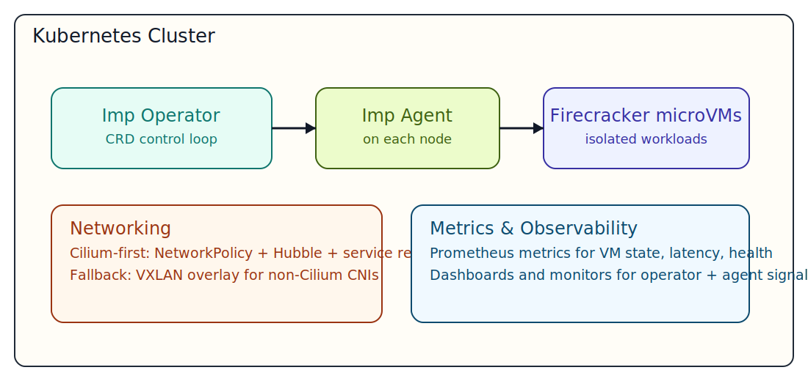
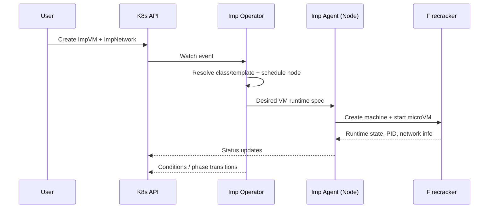

# Imp

```text
  )\  /(
 (  \/  )    ╦╔╦╗╔═╗
 ( ●  ● )~~✦ ║║║║╠═╝
  \ ‿  /     ╩╩ ╩╚
  (    )~,
  /\  /\     v0.1.0 · imp.dev
```

[](https://github.com/syscode-labs/imp/actions/workflows/ci.yml)
[](https://github.com/syscode-labs/imp/actions/workflows/lint.yml)
[](https://github.com/syscode-labs/imp/actions/workflows/codeql.yml)
[](https://go.dev/doc/devel/release)
[](LICENSE)

Imp is a Kubernetes operator and node agent for running Firecracker microVM workloads as first-class Kubernetes resources.
In plain terms: it gives you lightweight mini-VMs that behave like disposable app sandboxes, so you can run risky or isolated workloads without giving them access to your whole host.
A microVM is a very small virtual machine with stronger isolation than a container, and Firecracker is the open-source microVM runtime Imp uses to start those sandboxes quickly.

It provides CRDs for VM lifecycle, VM networking, snapshots, migrations, warm pools, and runner pools, with Cilium-first networking support, VXLAN fallback for non-Cilium CNIs, and built-in metrics for VM state, latency, and health.

## What Imp Manages

- `ImpVM`: microVM lifecycle and scheduling
- `ImpNetwork`: VM network, NAT, DNS, and optional Cilium integration
- `ImpVMSnapshot`: VM state snapshot lifecycle
- `ImpVMMigration`: migration orchestration
- `ImpWarmPool`: prewarmed VMs from snapshots
- `ImpVMRunnerPool`: VM pools for CI-style runner workloads
- `ImpVMClass`, `ImpVMTemplate`, `ClusterImpConfig`, `ClusterImpNodeProfile`

## Architecture



Excalidraw source: `docs/diagrams/imp-architecture.excalidraw`

## Limitations

- GPU passthrough is **not supported**.
  Firecracker in this project is used for CPU/memory/storage-isolated microVM workloads only.

## Quickstart

### Prerequisites

- Go `1.25.6+`
- Docker or compatible container runtime
- `kubectl`
- A Kubernetes cluster (Kind is supported for e2e)
- `helm` (recommended install path)

### Install with Helm (Recommended)

```sh
helm upgrade --install imp ./charts/imp -n imp-system --create-namespace
kubectl -n imp-system get pods
```

### Install with Kustomize/Make

```sh
make install
make deploy IMG=<registry>/imp-operator:<tag>
```

### Uninstall

```sh
helm uninstall imp -n imp-system
# or (kustomize path)
make undeploy
make uninstall
```

## First VM in 5 Minutes

Apply a minimal network and VM in `default` namespace:

```sh
kubectl apply -f - <<'EOF'
apiVersion: imp.dev/v1alpha1
kind: ImpNetwork
metadata:
  name: quick-net
  namespace: default
spec:
  subnet: 192.168.100.0/24
  nat:
    enabled: true
---
apiVersion: imp.dev/v1alpha1
kind: ImpVM
metadata:
  name: quick-vm
  namespace: default
spec:
  image: ghcr.io/syscode-labs/imp-guestbook:latest
  networkRef:
    name: quick-net
EOF
```

Check status:

```sh
kubectl get impvm -n default
kubectl describe impvm quick-vm -n default
kubectl get impnetwork quick-net -n default -o yaml
```

## VM Expiration (`expireAfter`)

Imp can automatically delete a microVM after a fixed runtime window.

- `0` or unset means disabled
- expiration is anchored to first `status.runningAt`
- on expiry, the controller issues normal `Delete` (graceful stop path first)

Resolution precedence:

1. `ImpVM.spec.expireAfter`
2. creator pool (`ImpVMRunnerPool.spec.expireAfter` / `ImpWarmPool.spec.expireAfter`)
3. `ImpVMTemplate.spec.expireAfter`
4. disabled

Quick example:

```yaml
apiVersion: imp.dev/v1alpha1
kind: ImpVMTemplate
metadata:
  name: ci-runner-template
  namespace: default
spec:
  classRef:
    name: ci-small
  image: ghcr.io/syscode-labs/test:latest
  expireAfter: 2h
---
apiVersion: imp.dev/v1alpha1
kind: ImpVMRunnerPool
metadata:
  name: ci-runner-pool
  namespace: default
spec:
  templateName: ci-runner-template
  expireAfter: 45m
  platform:
    type: github-actions
    scope:
      repo: your-org/your-repo
    credentialsSecret: gh-runner-token
```

See [examples/runner-pool-expiration](/Users/giovanni/syscode/git/imp/examples/runner-pool-expiration/README.md) for a complete runnable teaser.

## Development

```sh
make test
make lint
make build
```

Run operator locally:

```sh
make run
```

Run e2e tests (isolated Kind cluster):

```sh
make test-e2e
```

## OCI Golden Image + Firecracker E2E

The repository includes IaC scripts under `hack/`:

- `hack/oci-build-golden-image.sh`
- `hack/packer-build-golden-image.sh` (default build driver: native Packer OCI builder with script preflight/sanitization)
- `hack/oci-firecracker-e2e.sh`

`hack/oci-build-golden-image.sh` is idempotent for missing OCI inputs:

- auto-detects compartment and AD for `VM.Standard.E2.1.Micro`
- reuses existing public subnet or creates a minimal public VCN/subnet stack
- prunes oldest `imp-fc-golden-*` images when custom-image quota is full

`hack/packer-build-golden-image.sh` (recommended) now also performs post-build retention cleanup of old prefixed custom images:

- `OCI_POST_BUILD_PRUNE_OLD_IMAGES` (default `true`)
- `OCI_POST_BUILD_KEEP_IMAGES` (default `1`)

Build a minimal golden image:

```sh
IMP_OCI_PROFILE=syscode-api \
IMP_OCI_COMPARTMENT_NAME=homelab \
IMP_OCI_DOMAIN_NAME=homelab \
OCI_SSH_PUBLIC_KEY_FILE="$HOME/.ssh/builder.pub" \
OCI_SSH_PRIVATE_KEY_FILE="$HOME/.ssh/builder" \
OCI_OUTPUT_ENV_FILE="$HOME/.config/imp/oci-golden.env" \
hack/oci-build-golden-image.sh
```

Build via native Packer OCI builder:

```sh
IMP_OCI_PROFILE=syscode-api \
IMP_OCI_COMPARTMENT_NAME=homelab \
IMP_OCI_DOMAIN_NAME=homelab \
OCI_OUTPUT_ENV_FILE="$HOME/.config/imp/oci-golden.env" \
hack/packer-build-golden-image.sh
```

Run e2e using a generated image:

```sh
source "$HOME/.config/imp/oci-golden.env"
IMP_OCI_PROFILE=syscode-api \
IMP_OCI_COMPARTMENT_NAME=homelab \
IMP_OCI_DOMAIN_NAME=homelab \
OCI_GOLDEN_BUILD_DRIVER=packer \
OCI_SSH_PUBLIC_KEY_FILE="$HOME/.ssh/builder.pub" \
OCI_SSH_PRIVATE_KEY_FILE="$HOME/.ssh/builder" \
OCI_IMAGE_OCID="$OCI_IMAGE_OCID" \
hack/oci-firecracker-e2e.sh
```

Notes:

- OCI boot volume minimum is `50` GB.
- Golden image max size is controlled by `OCI_GOLDEN_MAX_GB` (default `50` GiB).
- Optional `OCI_GOLDEN_ZERO_FILL=true` can reduce sparse image footprint but is slower.
- For automation, use an unencrypted SSH key or load passphrase keys in `ssh-agent`.
- e2e auto-build defaults to `OCI_GOLDEN_BUILD_DRIVER=packer`; set `native-oci` only if needed.

## Networking Support

Imp provides first-class integration with **Cilium**. When Cilium is detected:

- VMs are enrolled as `CiliumExternalWorkload` resources
- Kubernetes `NetworkPolicy` applies to VMs
- VM traffic is visible in Hubble
- VMs can reach `ClusterIP` services via kube-dns

For non-Cilium CNIs (Flannel/Calico/Weave/etc.), Imp uses a VXLAN fallback for cross-node VM connectivity.

Cilium IPAM runbook: `docs/networking/cilium-ipam.md`

## Metrics & Observability

Imp exposes operator and agent metrics so you can monitor VM lifecycle and platform health:

- VM state and phase metrics
- Scheduling/boot latency metrics
- Guest resource metrics (CPU, memory, disk)
- Prometheus-compatible scraping and dashboards

## Reconcile Sequence



## Troubleshooting

- `ImpVM stuck in Pending`: check scheduler events and node capacity.
  `kubectl describe impvm <name> -n <ns>`
- No VM IP / networking issues: inspect `ImpNetwork` status and agent logs.
  `kubectl -n imp-system logs ds/imp-agent`
- Cilium features not active: verify Cilium CRDs exist and cni detection events.
  `kubectl get crd | grep cilium`
- Cilium IPAM/pool issues: verify `CiliumPodIPPool` exists and `ImpNetwork.spec.ipam.cilium.poolRef` matches.
  `kubectl get ciliumpodippool`
- Webhook admission failures: check cert-manager/webhook pods and certificates.
  `kubectl -n imp-system get pods,certificates,issuers`
- Snapshot or migration stalls: inspect related CR conditions.
  `kubectl describe impvmsnapshot <name> -n <ns>`
  `kubectl describe impvmmigration <name> -n <ns>`
- OCI image/e2e script failures: validate profile/session and compartment/env file values.
  `oci session validate --profile syscode-api`
  `source ~/.config/imp/oci-golden.env`

## Security Model

- Control plane:
  - Operator runs with Kubernetes RBAC scoped to Imp CRDs and required core resources.
  - Admission webhooks validate critical resources (`ImpVM`, `ImpVMClass`, `ImpVMTemplate`).
- Node plane:
  - Agent is privileged to manage Firecracker, networking, and host paths.
  - Limit agent deployment to trusted nodes via taints/selectors if required.
- OCI automation:
  - Use dedicated API user/group (`homelab-api`) with least-privilege policy.
  - Current policy is scoped to `syscode-labs:homelab` for compute/network/volume families.
  - Avoid tenancy-wide `manage all-resources`; use temporary broad grants only for debugging.
- Supply chain:
  - Pin operator/agent image tags in Helm values for reproducible deployments.
  - Prefer private registries and signed images where possible.
- Secrets:
  - Keep OCI keys out of repo and use local profile files or external secret stores.
  - Use short-lived session tokens for admin profiles where practical.

## Distribution

Create a single install bundle:

```sh
make build-installer IMG=<registry>/imp-operator:<tag>
```

This generates `dist/install.yaml`.

## Contributing

Contributions are welcome. Before opening a PR:

```sh
make manifests generate
make lint-fix
make test
```

## License

Copyright 2026.

Licensed under the Apache License, Version 2.0.
